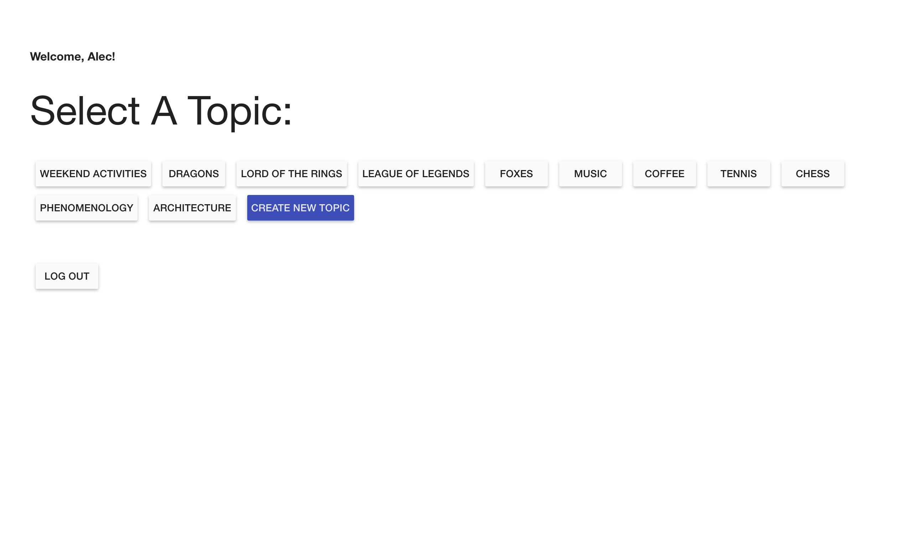
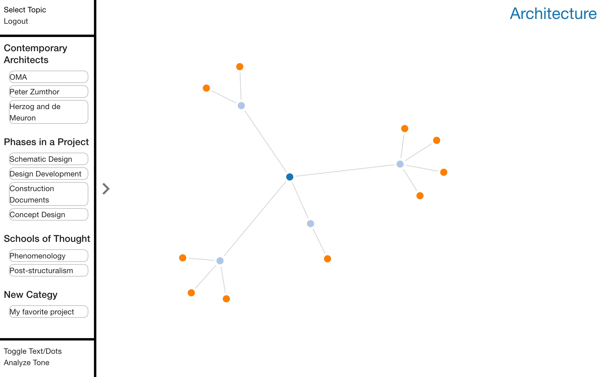
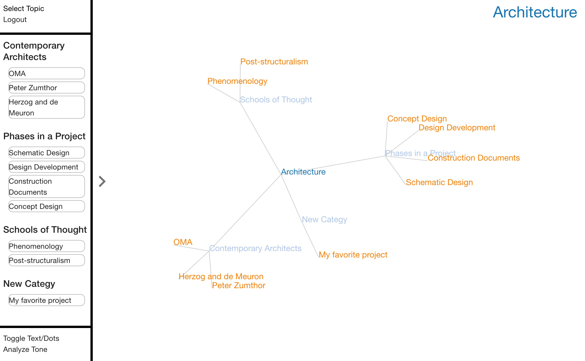

# Idea Shuffle

https://tranquil-waters-36326.herokuapp.com/#/home

One Paragraph of project description goes here. Link to the live version of the app if it's hosted on Heroku.

## Built With

D3.js, Alexa custom skills creation, AngularJS, AngularJS Material, ng-sortable, Node.JS, MongoDB, Express.js, HTML5, CSS3, and Javascript.

## Getting Started

-Clone the repository and copy it onto your machine
-Make sure mongo is running in an open tab
-Run 'npm install' and 'npm start' in terminal
-Open a browser window to 'localhost:5000'

### Prerequisites

- [Node.js](https://nodejs.org/en/)
- An Amazon Web Service (AWS) server will be required for the Alexa portion of the app.
- An Amazon Developer account will be required to create the skill with intents and slots.

### Installing

Steps to get the development environment running.

## Screen Shots

Loading pages.

Dot brainstorming web.

Loading pages.

## Documentation

Link to a read-only version of your scope document or other relevant documentation here (optional). Remove if unused.

### Completed Features

High level list of items completed.

- [x] Feature a
- [x] Feature b

### Next Steps

Features that you would like to add at some point in the future.

- [ ] Feature c

## Deployment

Add additional notes about how to deploy this on a live system

## Authors

* Name of author(s)

## Acknowledgments

* Hat tip to anyone who's code was used
